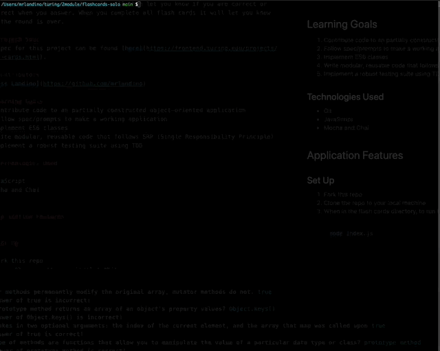

# Flash Cards
## Overview
This Flashcards game allow you to pull up a set of "flash cards" in your terminal and answer questions that are given. It will then let you know if you are correct or incorrect when you answer. When you complete all flash cards it will let you know when the round is over.

### Project Spec
The spec for this project can be found [here](https://frontend.turing.edu/projects/flash-cards.html).

### Contributors
* [Ross Landino](https://github.com/mrlandino)

## Learning Goals
1. Contribute code to an partially constructed object-oriented application
2. Follow spec/prompts to make a working application
3. Implement ES6 classes
4. Write modular, reusable code that follows SRP (Single Responsibility Principle)
5. Implement a robust testing suite using TDD

### Technologies Used
* Git
* JavaScript
* Mocha and Chai


## Application Features


### Set Up

1. Fork this repo
2. Clone the repo to your local machine
3. When in the flash cards directory, to run the game you need to run:
```bash
node index.js
```
