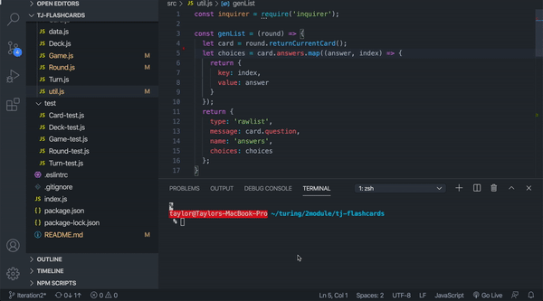
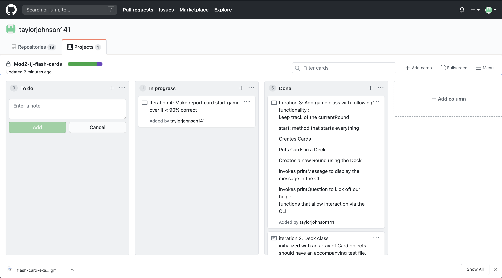

### Taylor Johnson Flash Card Project
For this project we where tasked with creating a console based flashcard game. The object of the project was to practice encapsulation and Test Driven Development.

A GIF of the working application

Project Board : 

Install/Setup instructions

To play this game fork the repo.
Clone down the repo.
Open your terminal 
run npm install
