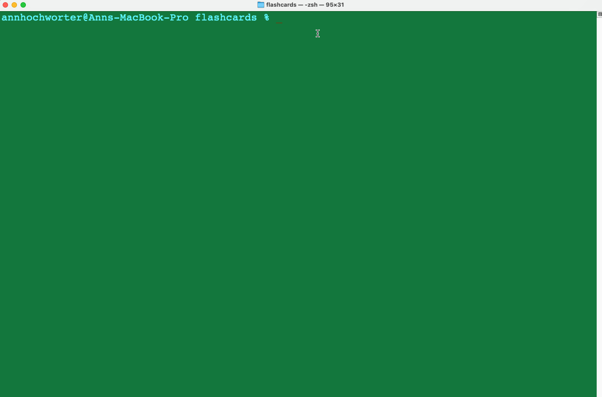

# FlashCards

## Abstract

This cute and fun flashcard game will help sharpen your JavaScript knowledge. The flashcards appear in the command-line offering a fast and engaging way to bolster one's grasp of JavaScript prototype methods. Users can tackle questions and promptly receive feedback. 👍

This project also aimed to introduce concepts and begin practicing skills in employing Test-Driven Development (TDD). A comprehensive testing suite was built in tandem to the game code to aide in validating the functionality. As users journey through the game, their accumulation of correct answers will be quantified and reported back to them when the round is over, fostering an interactive learning experience.

## Technologies:

JavaScript, Terminal, VS Code, GitHub

## Resources:

Google, Turing School Cohorts and Mentors, MDN Documents

## Installation Instructions

1. Fork this repository.
2. Clone it to your local system.
3. Navigate into the repository directory.
4. Run `node index.js` in your terminal.

## Preview of App:

