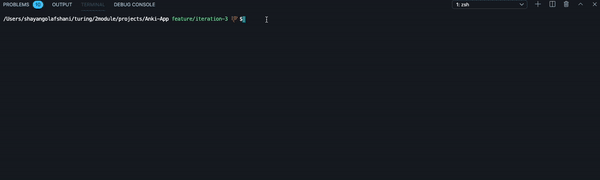

# Anki-App

## About this project

This project is a flash-card app that you can populate with your own data,
or you can use to quiz yourself. It is played with node in your terminal/console.

## Setup & Install Instructions

To set-up and use the Anki-App, first clone down the repo. Hit the code button and copy the SSH key. 
Next, run `git clone` + the SSH key in your terminal.

```bash
git clone git@github.com:shayan-golafshani/flashcards-starter.git
```

Once you have cloned the repo, change into the directory and install the library dependencies. Run:

```bash
npm install
```

To play the flash-card (Anki) game, run `node index.js` in your terminal. You should see a game pop-up with 30 cards. To answer questions, type the number corresponding to the answer you'd like to input and press the ***enter*** key.

A message will then display telling you whether or not you got the answer correct.

Hit the ***enter*** key again to move on to the next question and continue this way until you have finished all questions. 

You will be prompted with a timer message that show's you how long it took you to play the game in minutes, seconds, and milliseconds, and after that
a message will display showing the percentage of questions you answered correctly.

Then you can type 
```bash
ctrl + c
```
to clear the terminal and retype `node index.js` in your terminal to play the game again.

### Technologies used & Skills used
- JavaScript
- Mocha Testing framework
- Chai assertion library
- Test driven development


## How it works

Here is a gif demonstrating playing the game with the test data.


