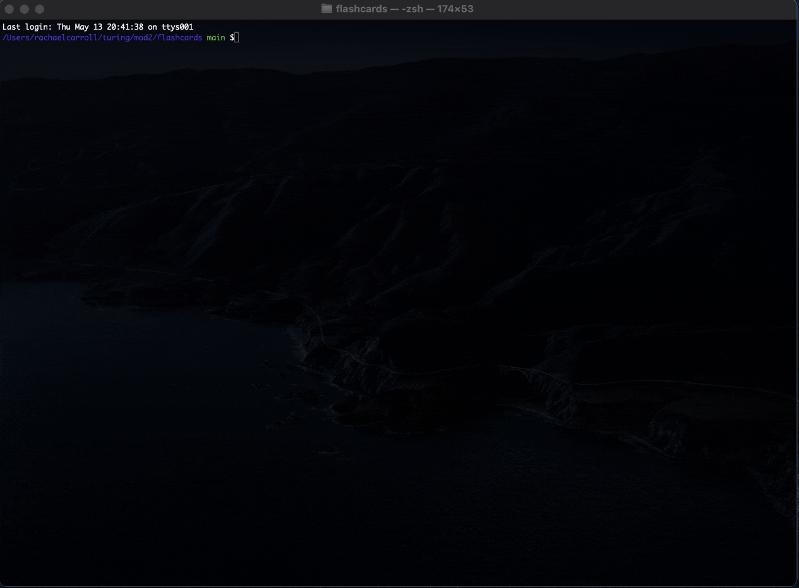

# Flashcards

## About

FlashCards is a study application that is played using basic keyboard controls through the command line interface. The app presents coding-related study questions to the user, prompting user to select one of three multiple choice options. Once selection is made, feedback is given indicating whether the question was answered correctly, as well as a percentage of correctly answered questions once user had gone through all 30 questions.

## Technologies Used

* Turing School of Software Design - [FlashCards starter-kit](https://github.com/turingschool-examples/flashcards-starter)
* Atom (text editor)
* npm 7.11.2 (package manager)
* Mocha 6.1.4 (testing framework)
* Chai 4.2.0 (assertion library)
* Eslint 5.16.0 (linter)
* Inquirer 6.3.1 (dependencies)

## Install & Game Play Instructions

- Clone this [repo](https://github.com/rachaelcarroll/flashcards) to your local computer
- From the terminal, navigate into the cloned repository and ensure Node Package Manager is installed by entering the command `npm install`
- Launch the application by entering the command `node index.js`
- Use the `up/down arrow` keys to select from the multiple choice options for each question
- Press the `return` key to submit answer
- Press `return` again to proceed to to the next question
- Exit game at any time by pressing `control + C`

## Contributor

- [Rachael Carroll](https://github.com/RachaelCarroll)
