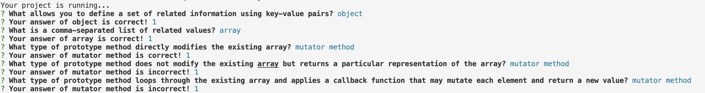

# FlashCards Starter Kit

## Abstract:
I built a flashcard question and answer game that is played strictly through the console. The user is given 30 questions with multiple choice answers. The user is notified if the answer is correct or incorrect, and the toal percentage of questions correct is displayed to the user at the conclusion of the round. 

## Installation Instructions:
To use this feature, you can head to my GitHub page, clone the repository, open it in the terminal, and run node index.js to start game play! 

## Preview of App:
()

## Context:
This project was the inagural project for a new "inning" in the Turing program. I am six weeks into the program. I had four days to complete the project. 

## Contributors:
https://github.com/kelleyej

## Learning Goals:
The learning goals for this project were to get an introduction into implementing a testing suite using test driven development. 

## Wins + Challenges: 
Some wins with this project included getting hands-on experience/practice with implementing testing suites and using beforeEach for the first time. A challenge during this project was figuring how to initiate the game via the terminal. 
